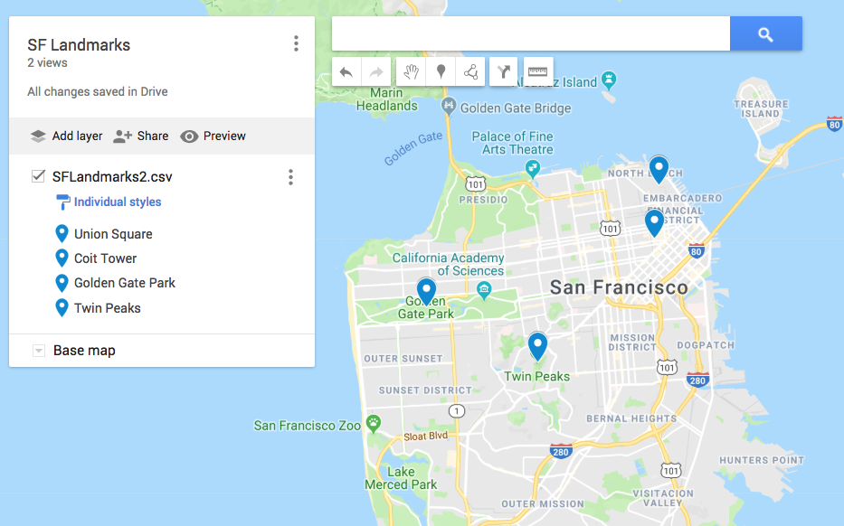
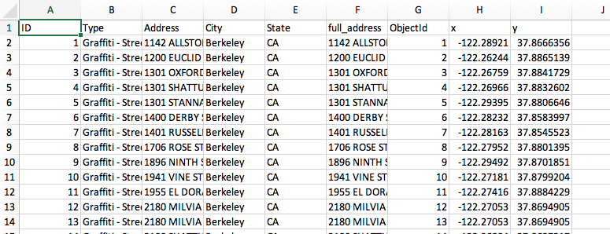

```{r setup, include=FALSE}
knitr::opts_chunk$set(echo = TRUE, eval=TRUE)
```


## Geocoding Fundamentals

- Download the zipfile from 
https://github.com/dlab-geo/geocoding

- unzip the files

- start RStudio

- start a new R script file

- set your working directory to the location of the unzipped files


## Introductions

About me...

Questions for you...

</img>
</img>

## Workshop Overview

- Intro to Geocoding
- Review of Geocoding tools
- Practice Using a few tools
- Focus on ESRI ArcGIS Online Geocoder

## What is Geocoding

Obtaining geographic coordinates for named places, street addresses, or zip codes.

</img>

## Types of places you can Geocode

Named places, codes or addresses

- country, state, city, building, 
- treet address or intersection, 
- named landmarks like Mt Everest,
- zip codes


## Why Geocode?

- Display locations on a map

- Link data by location

- Spatial analysis
    - Calculate distance, direction, area, etc.
    - Identify patterns & relationships:
        - clusters, outliers, neighbors

## Geocoding Components

`File of Input locations`

- places of the same type in a standard format


`A Geocoder`

- Software and a reference database
- The software compares input locations to database & returns matches


`Output file`

- Geographic coordinates for each matched input location
- Metadata about the match

## Reference Databases

What types of data are available for geocoding

- Rooftop
- Parcel
- Street Addresses
- Dual Street Address Range
- Street Address Range
- Street, City, Zipcode, State

## Dual Address Range

Where do you think the point for `275 5th St NE` would be located?

</img>

## Dual Address Range

Where do you think the point for `275 5th St NE` would be located?

</img>


## Parcel & Rooftop Reference Database

Addresses would match to centroid of parcel or rooftop

</img>


## Reference Database Quality

</img>

## Geocoding in Everyday Life

- Directions on your phone

- Search a place on Google Maps

</img>

## Geocoding Workflow

- Consider your needs & options
- Choose geocoder
- Preprocess / clean your input data
- Geocode
- Evaluate your output
- Postprocess as needed

## Considerations

- Geographic & temporal scope
- Output type and quality
- Volume / speed
- Security
- Costs of software and data
- Ease of use


# Geocoding Tools

## Geocoding to Make Maps

Many online tools will geocode "on the backend" but not give you access to the output.

- [Google MyMaps](https://support.google.com/mymaps/answer/3024396?co=GENIE.Platform%3DDesktop&hl=en)

- [Social Explorer](https://www.socialexplorer.com)

## Practice - [Google MyMaps](https://mymaps.google.com/)

1. Open [Sample Geocoding Data Google Sheet](https://docs.google.com/spreadsheets/d/1lVH6mco1ggWDbQTWWPllRZAMFoa6Dy9WEX1ls333rco/edit?usp=sharing)
2. Take a look at the `SF Landmarks` worksheet
3. Download `SF Landmarks` worksheet 
    - File > Download as > CSV
4. Open [Google MyMaps](https://mymaps.google.com/)
5. Create a new Map
6. Click `IMPORT` and import the CSV file you just downloaded

## [Google MyMaps](https://mymaps.google.com/)

</img>

## Practice - - [Social Explorer](https://www.socialexplorer.com)

I will just **DEMO** with Berkeley Grafitti worksheet data

# That's great ...BUT...

## Show me the COORDS!

</img><br>


# Geocoding without Programming

## Geocoding 

**When I have 1-10 locations to geocode...**

- [Google Maps](maps.google.com)

*I will DEMO this*

## Geocoding

**When I have 10 - 1,000 US addresses & feel good about taxpayer supported tools...**

- [US Census Geocoding Tool](https://geocoding.geo.census.gov/geocoder/locations/onelineaddress?form)

## Practice - [US Census Geocoding Tool](https://geocoding.geo.census.gov/geocoder/locations/onelineaddress?form)

- Open the Census Geocoding website 

- Select `Find Locations Using...OPTION` > `Address Batch`

- Download the [sample CSV file](https://geocoding.geo.census.gov/geocoder/Addresses.csv) from the Census website to see the needed file format

## Practice - [US Census Geocoding Tool](https://geocoding.geo.census.gov/geocoder/locations/onelineaddress?form)

- View the `Orig_Grafitti_street_addresses` worksheet in the [Sample Geocoding Data Google Sheet](https://docs.google.com/spreadsheets/d/1lVH6mco1ggWDbQTWWPllRZAMFoa6Dy9WEX1ls333rco/edit?usp=sharing)

- Copy & past the `Grafitti` to a new sheet and get it into the required format

- Download this revised worksheet to CSV

## Practice - [US Census Geocoding Tool](https://geocoding.geo.census.gov/geocoder/locations/onelineaddress?form)

- Select the downloaded file to geocode the addresses using the Census geocoder

- Click `Get Results` and then review the output

## Census Geocoder Output

</img>


## Geocoding

**When I have 1,000 - 10,000,000 and want a high level of control and output quality...**

- [ESRI](https://docs.google.com/document/d/1JGMW0Lk3FnOPjGVxCQCFMT4SwHio239z-Yb8qdlEs6k/edit?usp=sharing)
    - ArcGIS Online Platform
    - ArcGIS/ArcPro Desktop software


## Why ESRI Products?

They are very good for geocoding and other geo tasks!

They are free to UCB Community via Campus Site License.

</img>

## ArcGIS Desktop/Pro vs ArcGIS Online

</img>


## ArcGIS Online (AGOL)

`Pros`

- No need to install software or data
- Access anywhere with calnet id & browser
- Simple geocoding workflow
- High quality geocoder, global in scope, always up to date
- Unlimited ESRI credits with the campus site license

## ArcGIS Online (AGOL)

`Cons`

- No customization of the geocoder
- No output metadata
- Complicated workflow to download geocoded data
- Can be slow with lots of data
- 5000 per person credit limit for AGOL
    - need to ask for more
    - One geocode “costs” 0.04 credits, 
    - 125,000 geocodes = 5,000 credits


## ArcGIS Desktop/Pro

`Pros`

- Fast & Customizable
- Returns lots of metadata about the geocoded results
- Can use with online ESRI World Geocoding Service
- Can also use a local reference database
- Can be offline / secure

*Available in the D-Lab*


## ArcGIS Desktop/Pro

`Cons`

- Need to install software locally 
- Only runs on Windows
- Can install & use local reference database but 
    - it is huge (60-80GB), 
    - needs to be updated and 
    - requires a separate license file
    - only available for USA & Canada

## Practice - ArcGIS Online

- Download the `New_Grafitti_street_addresses` [worksheet](https://docs.google.com/spreadsheets/d/1lVH6mco1ggWDbQTWWPllRZAMFoa6Dy9WEX1ls333rco/edit?usp=sharing) as CSV

- Login to [cal.maps.arcgis.com](https://cal.maps.arcgis.com)

- Click on `Sign in to University of CA Berkeley using CALNET` Account.

</img>

## AGOL Content

- Go to `Content`

</img>


## Geocode a file

- `Add Item > From My Computer`

</img>

## Upload File

</img>

## Review Geocoded files


</img>

## Return to your Content page

</img>

## Review your Content

- You have the original uploaded CSV file
- and the `GEOCODED` Feature Layer (hosted)

</img>

## Review your Content

- You have the original uploaded CSV file
- and the `GEOCODED` Feature Layer (hosted)

</img>

## Export GEOCODED Feature Layer

You need to export the GEOCODED feature layer to a CSV file and then download that CSV file to save the geocoded data locally.

Click on the feature layer to do this...

</img>

## Export to CSV

</img>

## Export to CSV

</img>

## View Content & Download

Now you can `download`
</img>

## AGOL Geocoded Data

</img>

## AGOL Recap

You can geocode 1- 50,000 addresses, place names or geocodes without problem in AGOL. If you have more than that you may want to think about your 5,000 ESRI `credits`.

You may need your credits for other work you do on AGOL.

You may need to allow for time to request and receive more credits for big geocoding jobs.


# Geocoding Programmatically with APIs

## Geocoding API

Write a script (short computer program) to geocode your data.

- often written in R, Python, or Javascript

 
 
API: `Application Programming Interface`

- A set of functions, tools and protocols for making data requests using a computer program or script.


## Free APIs for Geocoding

- [US Census Geocoding API](https://geocoding.geo.census.gov/geocoder/Geocoding_Services_API.pdf)
 
- [OpenStreetMap Nominatim Geocoding Service](https://wiki.openstreetmap.org/wiki/Nominatim)

- [Mapquest Open](https://developer.mapquest.com/documentation/open/nominatim-search/)


## Freemium APIs for Geocoding

- [Google Maps Geocoding API](https://developers.google.com/maps/documentation/geocoding/start)
 
- [ESRI World Geocoding Service API](https://docs.google.com/document/d/1JGMW0Lk3FnOPjGVxCQCFMT4SwHio239z-Yb8qdlEs6k/edit?usp=sharing)

- *And many others...*

`Prices and terms of use subject to change on freemium services!`


## Practice - OSM Nominatim

View the [OpenStreetMap Nominatim Geocoding Service](https://wiki.openstreetmap.org/wiki/Nominatim) Documentation

The format of a geocoding search request:

- https://nominatim.openstreetmap.org/search?q=


Try a geocoding search request in a web browser

https://nominatim.openstreetmap.org/search?q=Barrows Hall, Berkeley CA

*Click on the `details` button in upper left when you get results*

## Using a Geocoding API

Almost all Geocoding APIs ask that you register for an API key

You use that key in your requests to use the service.

Some Freemium services ask for a credit card even if there is a free level of service.


## Geocoding in Python

Most folks use the [geopy](https://geopy.readthedocs.io/en/latest/#nominatim) package because it provides a consistent interface to a number of different geocoding APIs.

**DEMO** if time using [Google Collaboratory](https://colab.research.google.com/drive/19TbFZCaOBcCJ8aNoRM0CAfhAZqDnPaVm)

## Geocoding in R

More of a geocoding API specific landscape of packages

- `ggmap` package for the Google Geocoding API

- I have some [R geocoding scripts](https://github.com/dlab-geo/RGeocoding/tree/master/scripts) on github you can review if you want to check them out.


## ESRI Geocoding Resources

Google Doc to guide you through geocoding with ESRI ArcGIS Online, Desktop or World Geocoding Service API

[Geocoding Options with ESRI Software & Data](https://docs.google.com/document/d/1JGMW0Lk3FnOPjGVxCQCFMT4SwHio239z-Yb8qdlEs6k/edit?usp=sharing)


# QUESTIONS?

# Thank you!

